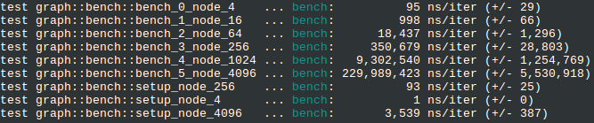

# dijkstrust
## What is

Dijkstra's shortest path in rust

## Benchmarking

**Install nightly**

```rustup install nightly```

**Swap nightly default**

```rustup default nightly```

**To benchmark**

```cargo bench --features unstable```

First run will take forever, creating benchmark files; up to 200mb for the 4k nodes


i7 7700HQ 4x2.8


